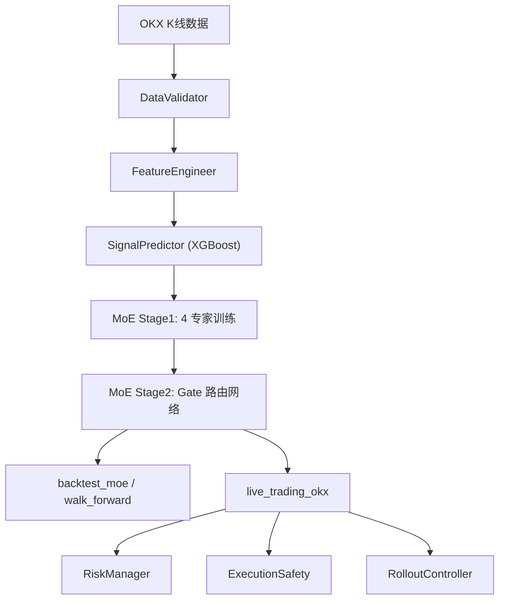

# 强化学习加密货币量化交易系统

> Mixture-of-Experts (MoE) x Deep Reinforcement Learning x XGBoost  
> OKX 永续合约 `ETH/USDT:USDT`，日频策略，当前主线为 4 专家版本。

## 项目定位

本项目是一套 ETH 加密货币量化交易系统，覆盖数据清洗、特征工程、XGBoost 信号预测、4 专家 MoE 强化学习决策、执行安全、风险管理、实盘调度与监控。

当前主线只保留 4 个稳定专家：

| 专家 | 算法 | 数据切片 | Feature Mask | 训练步数 |
|------|------|----------|--------------|----------|
| `E2_PPO_bear_drawdown` | PPO | bear | risk | 150K |
| `E4_PPO_highvol_risk` | PPO | high_vol | risk | 150K |
| `E5_PPO_lowvol_carry` | PPO | low_vol | carry | 150K |
| `E7_SAC_fast_adapt` | SAC | range | switch | 180K |

稳定模型注册表：

- `stable_run_id`: `moe_4exp_walkforward_fold5_2026`
- `stable_model_path`: `checkpoints/moe/stable`
- `stable_gate_temperature`: `0.5`

## 架构



## 核心目录

| 路径 | 作用 |
|------|------|
| `crypto_trader/configs/moe_experts.yaml` | 当前 4 专家 manifest |
| `checkpoints/moe/stable/` | 当前稳定 4 专家模型与 Gate |
| `crypto_trader/train_moe_stage1.py` | 4 专家独立训练 |
| `crypto_trader/train_moe_stage2_gate.py` | Gate 路由训练 |
| `crypto_trader/backtest_moe.py` | MoE 回测 |
| `crypto_trader/walk_forward/` | Walk-Forward 样本外验证 |
| `crypto_trader/live_trading_okx.py` | OKX 实盘执行主链路 |
| `scripts/` | 调度、巡检、监控脚本 |
| `quant_docs/` | 风险、验证、执行和治理文档 |

## Walk-Forward 状态

当前 4 专家版本的 Walk-Forward 摘要位于：

- `docs/WALK_FORWARD_SUMMARY.md`

当前总判定为 `FAIL`：

- 完成 5 折验证
- 通过 3 折
- 平均 Alpha 为 0.39%，低于 20% 目标
- 最新 fold_5 表现较好，但 2023 和 2024 阶段跑输 ETH Buy & Hold

因此这个版本可以作为 4 专家主线继续迭代，但不能把 Walk-Forward 结论表述为整体通过。

## GitHub 公开版边界

本仓库按公开上传版本整理：源码、稳定配置、小体积稳定模型、测试和研究文档保留；本地密钥、交易状态、日志、运行结果、重复 walk-forward checkpoint、内部过程稿和生成数据快照不进入 Git 历史。详细边界见 `docs/GITHUB_RELEASE.md`。

## 快速开始

```bash
python3 -m venv venv
source venv/bin/activate
pip install -r requirements.txt
```

构建 MoE 数据集：

```bash
PYTHONPATH=. python crypto_trader/scripts/build_moe_dataset.py \
  --symbol ETH/USDT:USDT \
  --start 2020-01-01 \
  --end 2026-02-16 \
  --interval 1d \
  --output-prefix crypto_trader/data_moe_20200101_20260216
```

训练专家：

```bash
PYTHONPATH=. python -m crypto_trader.train_moe_stage1 \
  --manifest crypto_trader/configs/moe_experts.yaml \
  --output-root checkpoints/moe/stable/experts \
  --train-data-path crypto_trader/data_moe_20200101_20260216_train80.csv
```

训练 Gate：

```bash
PYTHONPATH=. python -m crypto_trader.train_moe_stage2_gate \
  --manifest crypto_trader/configs/moe_experts.yaml \
  --stage1-root checkpoints/moe/stable/experts \
  --output-root checkpoints/moe/stable/gate \
  --train-data-path crypto_trader/data_moe_20200101_20260216_train80.csv
```

运行回测：

```bash
PYTHONPATH=. python -m crypto_trader.backtest_moe \
  --manifest crypto_trader/configs/moe_experts.yaml \
  --stage1-root checkpoints/moe/stable/experts \
  --stage2-root checkpoints/moe/stable/gate \
  --data-path crypto_trader/data_moe_20200101_20260216_oos20.csv \
  --gate-temperature 0.5
```

健康检查：

```bash
bash scripts/health_check_stable.sh
```

测试：

```bash
python3 -m pytest crypto_trader/tests -q
```

## 实盘边界

实盘入口仍然通过 `live_trading_okx.py` 和调度脚本运行。真实下单需要 `.env.live`、OKX API 配置和 `CONFIRM_REAL_MONEY=True`。当前系统是 CRON/launchd 调度的一次性日频执行模型，不是常驻 daemon。

公开仓库不要提交 `.env`、`.env.live` 或真实 webhook。复制 `.env.example` 到本地环境文件后再填写凭据。

## 当前主线原则

- 只维护 4 专家 MoE 主线。
- 稳定模型只从 `checkpoints/moe/stable` 读取。
- 训练、回测、实盘和文档都以 `crypto_trader/configs/moe_experts.yaml` 为唯一 manifest。
- 旧候选实验、旧专家配置和旧实验脚本不再作为项目入口保留。
