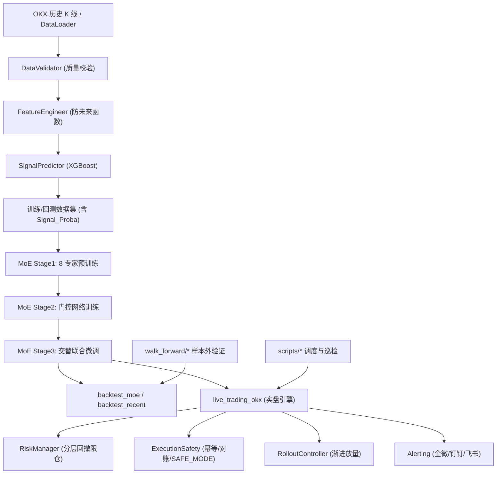

# 强化学习加密货币量化交易系统

> **Mixture-of-Experts (MoE) × Deep Reinforcement Learning × XGBoost 多层决策架构**
>
> 面向 OKX 永续合约 · 当前主线标的 `ETH/USDT:USDT` · 日频策略

---

## 1. 项目定位

本项目是一个**生产级**的加密货币量化交易系统。它并非单一模型的策略原型，而是一个从数据清洗、特征工程、信号预测、多专家强化学习决策、执行安全、风险管理到实盘调度与监控的**全链路闭环系统**。

系统目标：
- 用**多专家强化学习（MoE）** 替代单模型决策，利用 8 个深度特化的 RL 智能体 + 1 个门控网络，在不同市场状态（牛市/熊市/震荡/高波/低波）下实现自适应切换。
- 将**交易执行安全**（幂等下单、交易所对账、SAFE_MODE 紧急模式）和**分层风险控制**内置进实盘链路，而不仅仅停留在回测层面。
- 保留完整的**可复现实验路径**（Stage1/2/3 训练、Walk-Forward 验证、区间回测）。

当前稳定版本指标（OOS 样本外测试集 2025-01-05 至 2026-02-16）：
- **总收益：+90.83%** | 最大回撤：16.68% | 夏普比率：1.42
- 同期 ETH Buy & Hold 基准：-45.27%
- **超额收益 Alpha：+136.10%**

---

## 2. 全景架构



**分层理解：**

| 层级 | 职责 | 核心文件 |
|------|------|---------|
| **数据层** | 行情获取、质量校验、特征工程 | `data_loader.py`, `data_validator.py`, `features.py` |
| **信号层** | XGBoost 微观涨跌概率预测 | `models/signal_model.py` |
| **决策核心层** | 8 专家 RL + 门控路由（MoE） | `train_moe_stage1/2/3.py`, `moe/manifest.py`, `moe/regime.py` |
| **环境仿真层** | 交易执行约束、成本建模、Reward 函数 | `envs/trading_env.py`, `asset_profile.py` |
| **风控与安全层** | 回撤熔断、幂等下单、对账 | `risk_manager.py`, `execution_safety.py` |
| **执行与运维层** | 实盘引擎、渐进放量、调度、告警 | `live_trading_okx.py`, `rollout_controller.py`, `alerting.py` |
| **验证层** | MoE 回测、Walk-Forward、区间验证 | `backtest_moe.py`, `walk_forward/` |

---

## 3. MoE 决策核心：详细架构

### 3.1 专家清单（8 专家）

配置文件：`crypto_trader/configs/moe_experts.yaml`

| Expert | 算法 | 数据切片 | 特征视野 | Reward 偏好 | 训练步数 |
|--------|------|---------|---------|------------|---------|
| E1_PPO_trend_return | PPO | bull（前 35% 涨幅） | trend | return↑ 1.20 | 150K |
| E2_PPO_bear_drawdown | PPO | bear（后 35% 跌幅） | risk | drawdown↓ 1.60 | 150K |
| E3_PPO_range_calmar | PPO | range（波动最小 40%） | carry | sortino 1.30 | 150K |
| E4_PPO_highvol_risk | PPO | high_vol（ATR 前 30%） | risk | drawdown↓ 1.50 | 150K |
| E5_PPO_lowvol_carry | PPO | low_vol（ATR 后 30%） | carry | 均衡 1.00 | 150K |
| E6_SAC_tail_hedge | SAC | high_vol | risk | drawdown↓ **1.80** | 180K |
| E7_SAC_fast_adapt | SAC | range | switch | 均衡 | 180K |
| E8_A2C_regime_switch | A2C | **full（全量）** | switch | 均衡 | 120K |

**Feature Mask 定义**（`crypto_trader/moe/manifest.py`）：

| Mask 名称 | 可见的观测维度 | 设计意图 |
|-----------|:---:|------|
| `all` | 0-12 全部 | 全视野 |
| `trend` | 0,3,4,5,7,9,10,12 | 侧重趋势信号（Signal_Proba, RSI, MACD, Dist_SMA200） |
| `risk` | 0,1,3,6,8,10,11,12 | 侧重风险因子（Cooldown, Rolling_Vol, BB_Width, Vol_Ratio） |
| `carry` | 0,3,4,6,10,11,12 | 侧重微观套利（Signal_Proba, Rolling_Vol, ATR, Vol_Ratio） |
| `switch` | 0,1,3,4,6,7,11,12 | 侧重状态切换（Cooldown, Signal_Proba, MACD, Vol_Ratio） |

**数据切片逻辑**（`crypto_trader/moe/regime.py`）：

系统在 Stage 1 训练时，基于 20 日动量和 ATR% 对全历史数据进行市场状态切片。例如 `bull` 切片仅保留动量值在 65 分位以上的时段，`bear` 切片仅保留 35 分位以下的时段。这种强制的温室隔离环境逼迫每个专家在特定的市场微环境中学习到极致的专精策略。

### 3.2 门控路由机制

核心逻辑：`crypto_trader/train_moe_stage2_gate.py`

```
输入: 环境观测 obs (13 维)
  ↓
Gate PPO 网络 → 输出 8 维 logits
  ↓
softmax(logits / temperature) → 权重 w = [w1, w2, ..., w8]
  ↓
各专家独立推理（带 Feature Mask）→ 动作 a = [a1, a2, ..., a8]
  ↓
加权融合: a_mix = Σ(w_i × a_i), clip to [-1, 1]
  ↓
TradingEnv 执行（应用约束后落地为实际仓位）
```

门控奖励函数：
```python
routed_reward = reward - load_balance_coef × balance_penalty + diversity_coef × diversity_bonus
```
- `balance_penalty`: EMA 权重偏离均匀分布的 MSE，防止单专家垄断（coef=0.02）
- `diversity_bonus`: 专家动作标准差，鼓励多样性（coef=0.01）
- `gate_temperature`: Softmax 温度参数，当前稳定版为 **0.68**（低温 → 更果断的专家选择）

### 3.3 三阶段训练范式

| 阶段 | 训谁 | 冻谁 | 核心逻辑 |
|------|------|------|---------|
| **Stage 1** | 8 个专家 | 无 | 按 manifest 逐个在切片数据上独立训练 |
| **Stage 2** | Gate 网络 | 全部专家 | Gate 学习在不同市场状态下分配专家权重 |
| **Stage 3** | 交替迭代 | 交替冻结 | 读取 Gate 的 `usage_ema`，按使用率重新分配各专家 finetune 步数，然后重训 Gate。多轮迭代 |

### 3.4 MoE 推理 / 回测流程

`crypto_trader/backtest_moe.py` 的逐步逻辑：
1. 加载 8 个专家模型 + 各自的 `VecNormalize` 归一化器
2. 加载 Gate PPO 模型 + Gate 的 `VecNormalize`
3. 对 OOS 数据集的每个时间步：
   - Gate 接收当前观测 → 输出 logits → Softmax 得权重
   - 8 个专家各自接收 Masked 观测 → 各输出 1 个动作 [-1, 1]
   - 加权融合为单一混合动作
   - `TradingEnv` 应用执行约束 → 落地为仓位变化 → 结算 PnL
4. 输出：总收益、回撤、夏普、Gate 使用率、专家贡献度、净值曲线图

---

## 4. 信号模型：XGBoost 概率预测

文件：`crypto_trader/models/signal_model.py`

### 4.1 模型定位

XGBoost 在本系统中**不直接产生交易指令**。它的唯一职责是预测**下一根 K 线收盘价高于当前收盘价的概率**（`Signal_Proba`），作为 RL 环境 13 维观测空间中的第 5 个特征（Index 4）喂给所有专家。

这种"情报员 + 司令官"的分工设计是刻意为之的：
- **XGBoost 擅长：** 从海量非线性技术指标中提纯微观涨跌信号（当前 OOS 准确率 54.55%）。
- **RL 擅长：** 动态资金管理、仓位控制、多步博弈优化。
- **两者互补：** XGBoost 提供稳定的概率情报，RL 基于该情报 + 其他因子做最终的开平仓决策。

### 4.2 模型参数

```python
XGBClassifier(
    n_estimators=200,      # 200 棵树
    max_depth=5,           # 树深度 5
    learning_rate=0.05,    # 学习率
    subsample=0.8,         # 行采样 80%
    colsample_bytree=0.8,  # 列采样 80%
    random_state=42,       # 固定种子
    eval_metric='logloss', # 对数损失
)
```

### 4.3 训练方式

- **严格时序切分：** 前 80% 数据训练，后 20% 验证。不使用随机打乱（Shuffle），避免未来信息泄漏。
- **特征排除：** 原始 OHLCV（Open/High/Low/Close/Volume）被排除在外，仅使用衍生技术指标。
- **输出格式：** `predict_proba()` 返回上涨概率数组，范围 [0, 1]。

---

## 5. 交易环境与执行约束

核心文件：`crypto_trader/envs/trading_env.py`

### 5.1 观测空间（Observation Space）

13 维连续向量，每一步传递给 RL 智能体：

| Index | 特征名 | 范围 | 说明 |
|:-----:|--------|------|------|
| 0 | `pos` | [-1, 1] | 当前持仓 |
| 1 | `cooldown_remaining` | [0, 1] | 冷却期剩余比例 |
| 2 | `unrealized_pnl_pct` | 浮点 | 未实现盈亏比例 |
| 3 | `nw_change_pct` | 浮点 | 上一步净值变化率 |
| 4 | `Signal_Proba` | [0, 1] | **XGBoost 上涨概率** |
| 5 | `RSI / 100` | [0, 1] | 相对强弱指标 |
| 6 | `Rolling_Vol` | 浮点 | 20 日滚动波动率 |
| 7 | `MACD / 100` | 浮点 | MACD 归一化 |
| 8 | `BB_Width / 1000` | 浮点 | 布林带宽度归一化 |
| 9 | `Dist_SMA_200` | 浮点 | 距 200 日均线乖离率 |
| 10 | `ATR / Close` | 浮点 | ATR 百分比 |
| 11 | `Vol_Ratio` | 浮点 | 成交量比率 |
| 12 | `direction` | {-1, 0, 1} | 当前持仓方向 |

### 5.2 动作空间（Action Space）

- **单一连续值 `[-1, 1]`**：表示目标仓位意图（-1=全额做空, 0=空仓, +1=全额做多）。
- RL 输出的是"意图"，最终仓位需经过四重执行约束后才落地。

### 5.3 四重执行约束（Turnover Reduction Constraints）

这些约束是系统能够在实盘中稳定运行的核心保障：

| 约束 | 参数 | 值（ETH 日频） | 作用 |
|------|------|:-----------:|------|
| **Hysteresis（迟滞）** | `tau` | 0.25 | 仓位变化绝对值 < tau 时不执行，过滤微小噪音 |
| **Slew-rate（变速限制）** | `delta_max` | 0.15 | 单步最大仓位变化量，防止满仓反手 |
| **Cooldown（冷却期）** | `cooldown_n` | 3 天 | 多空反转后强制归零 3 天，防止被来回鞭尸 |
| **Clip** | — | [-1, 1] | 硬性仓位边界 |

### 5.4 成本建模

| 成本项 | 参数 | 值 | 说明 |
|--------|------|:---:|------|
| 单边手续费 | `k_single` | 0.08% | Maker/Taker 平均 |
| 日化资金费率 | `funding_daily` | 0.03% | 永续合约隔夜成本 |
| 波动率缩放目标 | `target_atr_pct` | 5% | 波动率目标制，自动调节杠杆 |
| ATR 地板 | `atr_floor` | 0.5% | 防止极低波动时过度加杠杆 |
| 杠杆上下限 | `vol_scale_min/max` | 0.1x / 2.0x | 杠杆硬性天花板与地板 |

### 5.5 Reward 函数

环境的 Reward 由 4 个分量通过 `reward_profile` 加权合成：

```
reward = profile.return   × log_return
       + profile.sortino  × sortino_component
       - profile.drawdown × drawdown_penalty
       - profile.turnover × turnover_cost
```

不同专家的 `reward_profile` 权重不同，从而产生截然不同的交易风格。例如 `E6_SAC_tail_hedge` 的 `drawdown` 权重为 **1.80**（变态级回撤惩罚），迫使它学会极度保守的防御策略。

---

## 6. 特征工程管线

文件：`crypto_trader/features.py`

### 6.1 防未来函数设计原则

> **所有 rolling 指标在计算后进行 `shift(1)`，确保 t 时刻的决策仅使用 t-1 及更早的数据。**

这种严格的时间对齐会导致指标滞后一天，但彻底杜绝了 Look-Ahead Bias（未来函数偏差）——这是量化回测中最致命的数据泄漏源之一。

### 6.2 完整特征列表

基于 `asset_profile.py` 中的 ETH 配置参数生成：

| 特征 | Window | 计算方式 |
|------|:------:|---------|
| RSI | 14 | 昨日收盘价的 14 日相对强弱 |
| MACD | 12/26/9 | 昨日收盘的快慢 EMA 差值 |
| MACD_Signal | 9 | MACD 的 9 日信号线 |
| MACD_Pct | — | MACD / 昨日收盘 |
| BB_Upper / BB_Lower / BB_Width | 20 | 昨日收盘的 20 日布林带（2σ） |
| BB_Width_Pct | — | 布林带宽度百分比 |
| Log_Returns | 1 | 当日 vs 昨日的对数收益 |
| ATR | 14 | 昨日的 14 日平均真实波幅 |
| SMA_50 / SMA_200 | 50 / 200 | 昨日收盘的简单移动均线 |
| Dist_SMA_200 | — | (昨日收盘 - SMA200) / SMA200 |
| Vol_Ratio | 20 | 昨日成交量 / 20 日均量 |
| Rolling_Vol | 20 | 昨日对数收益的 20 日滚动标准差 |
| Ret_Lag_1/2/3 | — | 滞后 1-3 日的对数收益 |
| RSI_Lag_1/2/3 | — | 滞后 1-3 日的 RSI |
| ROC_3/5/10 | 3/5/10 | 昨日收盘的 3/5/10 日动量 |
| Range_Pct | — | (昨日最高 - 昨日最低) / 昨日收盘 |
| Volatility_Regime | 20 | Rolling_Vol / Rolling_Vol 的 20 日中位数 |

### 6.3 数据入口

- **数据获取：** `crypto_trader/data_loader.py`，通过 OKX 公共 API（Mainnet）获取历史 K 线。
- **数据校验：** `crypto_trader/data_validator.py`，检查时间连续性、极端价格跳变（>50% 视为异常）、非正价格、重复时间戳。

---

## 7. 数据集管线

### 7.1 完整数据集生成命令

```bash
PYTHONPATH=. python crypto_trader/scripts/build_moe_dataset.py \
    --symbol "ETH/USDT:USDT" \
    --start "2020-01-01" --end "2026-02-16" \
    --train-ratio 0.8 \
    --output-prefix "crypto_trader/data_moe_20200101_20260216"
```

生成 3 个文件：
- `*_full.csv`：全量数据（含 Signal_Proba）
- `*_train80.csv`：前 80%（约 2020-07 至 2025-01），用于 Stage 1/2/3 训练
- `*_oos20.csv`：后 20%（约 2025-01 至 2026-02），严格样本外测试

### 7.2 Signal_Proba 生成流程

在 `build_moe_dataset.py` 中：
1. XGBoost 仅在 `train80` 上 fit（进一步内部 80/20 切分验证）
2. 然后对 `full` 数据集整体 `predict_proba()`
3. 将预测概率写入 `Signal_Proba` 列
4. 切分为 train/oos 两个文件

> ⚠️ 注意：OOS 集中的 Signal_Proba 是由仅在训练集上学习的 XGBoost 模型生成的，不存在数据泄漏。

---

## 8. PPO / SAC / A2C 模型超参数

全局默认配置（`crypto_trader/config.py`）：

### 8.1 PPO 参数

| 参数 | 值 | 说明 |
|------|:---:|------|
| `learning_rate` | 3×10⁻⁴ | Adam 优化器学习率 |
| `gamma` | 0.995 | 折扣因子（高值 → 重视长期收益） |
| `n_steps` | 2048 | 每次更新前收集的步数 |
| `batch_size` | 256 | 小批量大小 |
| `ent_coef` | 0.005 | 熵增系数（鼓励探索） |
| `clip_range` | 0.2 | PPO 截断比率 |
| `gae_lambda` | 0.95 | GAE 优势估计参数 |
| `total_timesteps` | 150,000 | 默认训练步数 |

### 8.2 SAC 参数

| 参数 | 值 | 说明 |
|------|:---:|------|
| `learning_rate` | 3×10⁻⁴ | 与 PPO 保持一致 |
| `gamma` | 0.995 | 同上 |
| `batch_size` | 256 | 每步更新的 Replay Buffer 采样量 |
| `train_freq` | (1, "step") | 每步训练一次 |
| `gradient_steps` | 1 | 每个训练步的梯度更新次数 |

### 8.3 A2C 参数

| 参数 | 值 | 说明 |
|------|:---:|------|
| `learning_rate` | 3×10⁻⁴ | 与 PPO 保持一致 |
| `gamma` | 0.995 | 同上 |
| `n_steps` | PPO 的 1/16（最小 8） | A2C 较短的 rollout |
| `ent_coef` | 0.005 | 同 PPO |

---

## 9. 风控与执行安全链路

### 9.1 RiskManager（分层回撤限仓）

文件：`crypto_trader/risk_manager.py`

| 回撤阈值 | 仓位上限 | 说明 |
|:--------:|:-------:|------|
| < 5% | 100%（不限制） | 正常运行 |
| ≥ 5% | 80% | Tier 1：轻度收缩 |
| ≥ 10% | 50% | Tier 2：中度收缩 |
| ≥ 15% | 20% | 保命模式 |

### 9.2 Execution Safety（执行安全层）

文件：`crypto_trader/execution_safety.py`

| 能力 | 说明 |
|------|------|
| 动作幂等 ID | 每笔交易分配唯一 UUID，防止网络重试导致重复下单 |
| 订单状态机 | `pending → submitted → filled / failed` 持久化状态追踪 |
| 持仓对账 | 每次执行前对比交易所实际持仓与本地记录 |
| SAFE_MODE | 禁止开新仓，仅允许减仓（紧急避险模式） |
| API 健康检测 | 监控 API 连续失败次数和时钟漂移 |

### 9.3 Rollout Controller（渐进放量）

文件：`crypto_trader/rollout_controller.py`

候选模型上线时，不直接全量接管，而是按 `0.25 → 0.5 → 1.0` 的仓位乘数渐进放量。如果 KPI 不达标（如夏普低于阈值），自动降级或回滚到稳定模型。

### 9.4 告警

文件：`crypto_trader/alerting.py`

支持企微 / 钉钉 / 飞书 Webhook 推送。告警级别包括：回撤分级告警（5%/10%/15%）、资金异常波动告警（>5% 权益变化）、API 连接异常等。

---

## 10. 实盘与调度

### 10.1 实盘入口

| 入口 | 说明 |
|------|------|
| `crypto_trader/run_live.py` | 交互式实盘入口（含二次确认） |
| `crypto_trader/run_demo.py` | 切到 `.env.demo` 的模拟盘 |
| `crypto_trader/run_real.py` | 切到 `.env.live` 的真实盘 |
| `crypto_trader/live_trading_okx.py` | 主执行引擎（1342 行） |

### 10.2 实盘执行流程

```
每日 UTC 08:05 cron 触发
   ↓
防重复执行检查 → 数据就绪检查 → 风控巡检
   ↓
获取最新 500 天 K 线 → 特征工程 → 加载 SignalPredictor
   ↓
构造 TradingEnv 观测 → MoE 推理（Gate + 8 专家）
   ↓
波动率缩放 → RiskManager 限仓 → 四重执行约束
   ↓
计算目标合约数量 → OKX API 下单（限价单 + IOC）
   ↓
滑点校验 → 对账 → 记录日志 → 告警推送
```

### 10.3 调度与守护脚本

| 脚本 | 说明 |
|------|------|
| `scripts/daily_trade.sh` | 单次日频执行（稳定入口） |
| `scripts/launch_trading.sh` | 守护启动（含 caffeinate 防休眠） |
| `scripts/start_background.sh` / `stop_background.sh` | 本地后台启停 |
| `scripts/setup_cron.sh` | 写入带 marker 的 cron 定时任务 |
| `scripts/check_status.sh` | 查看 daemon 状态与最近日志 |
| `scripts/check_daily_execution.py` | 日频执行监控告警 |
| `scripts/health_check_stable.sh` | 一键检查 stable 注册表与 checkpoint 完整性 |
| `scripts/monitor_effectiveness_daily.sh` | 策略有效性日监控 |
| `scripts/monitor_effectiveness_weekly.sh` | 策略有效性周报 |

---

## 11. 回测与验证体系

### 11.1 主回测（MoE）

```bash
PYTHONPATH=. python -m crypto_trader.backtest_moe \
    --manifest crypto_trader/configs/moe_experts.yaml \
    --stage1-root checkpoints/moe/stable/experts \
    --stage2-root checkpoints/moe/stable/gate \
    --data-path crypto_trader/data_moe_20200101_20260216_oos20.csv \
    --gate-temperature 0.68 \
    --symbol ETH/USDT:USDT \
    --plot-path results/eth_stable_oos20_t068.png
```

### 11.2 指定区间回测

```bash
# 截取指定日期范围
awk -F, 'NR==1 || ($1 >= "2025-12-14" && $1 <= "2026-02-16")' \
    crypto_trader/data_moe_20200101_20260216_full.csv \
    > crypto_trader/data_moe_20251214_20260216_eval.csv

# 运行回测
PYTHONPATH=. python -m crypto_trader.backtest_moe \
    --data-path crypto_trader/data_moe_20251214_20260216_eval.csv \
    --gate-temperature 0.68 --symbol ETH/USDT:USDT
```

### 11.3 Walk-Forward 样本外验证

`crypto_trader/walk_forward/` 目录提供折叠式时间外推验证，独立于主 stable 目录运行。

### 11.4 当前稳定版基线指标

| 指标 | OOS 全量 (t=0.68) | 近 2 月窗口 |
|------|:---:|:---:|
| 总收益 | +90.83% | +33.06% |
| 基准 (Buy & Hold) | -45.27% | — |
| 最大回撤 | 16.68% | — |
| 夏普比率 | 1.42 | — |

---

## 12. 常用训练命令

### 12.1 Stage 1（专家预训练）

```bash
PYTHONPATH=. python -m crypto_trader.train_moe_stage1 \
    --manifest crypto_trader/configs/moe_experts.yaml \
    --output-root checkpoints/moe/stage1 \
    --train-data-path crypto_trader/data_moe_20200101_20260216_train80.csv \
    --symbol ETH/USDT:USDT
```

### 12.2 Stage 2（门控训练）

```bash
PYTHONPATH=. python -m crypto_trader.train_moe_stage2_gate \
    --manifest crypto_trader/configs/moe_experts.yaml \
    --stage1-root checkpoints/moe/stage1 \
    --output-dir checkpoints/moe/stage2 \
    --train-data-path crypto_trader/data_moe_20200101_20260216_train80.csv \
    --symbol ETH/USDT:USDT
```

### 12.3 Stage 3（交替联合微调）

```bash
PYTHONPATH=. python -m crypto_trader.train_moe_stage3_joint \
    --manifest crypto_trader/configs/moe_experts.yaml \
    --stage1-root checkpoints/moe/stage1 \
    --stage2-root checkpoints/moe/stage2 \
    --output-root checkpoints/moe/stage3 \
    --train-data-path crypto_trader/data_moe_20200101_20260216_train80.csv \
    --symbol ETH/USDT:USDT
```

### 12.4 运维命令

```bash
# 一键健康检查
bash scripts/health_check_stable.sh

# 本地后台启动 / 查看 / 停止
bash scripts/start_background.sh
bash scripts/check_status.sh
bash scripts/stop_background.sh

# 配置 cron 定时任务
bash scripts/setup_cron.sh

# 策略有效性监控
bash scripts/monitor_effectiveness_daily.sh
bash scripts/monitor_effectiveness_weekly.sh
```

---

## 13. 目录结构

```text
crypto_trader/
├── asset_profile.py                 # 资产参数配置（ETH 环境参数）
├── config.py                        # 全局配置（PPO 超参数、风控阈值等）
├── data_loader.py                   # OKX 历史数据获取
├── data_validator.py                # 数据质量校验
├── features.py                      # 特征工程（防未来函数）
├── models/signal_model.py           # XGBoost 信号模型
├── envs/trading_env.py              # 交易环境与四重执行约束
├── risk_manager.py                  # 分层风险管理
├── execution_safety.py              # 执行安全层（幂等/对账/SAFE_MODE）
├── rollout_controller.py            # 渐进放量/回滚
├── alerting.py                      # 告警（企微/钉钉/飞书）
├── moe/manifest.py                  # MoE 专家配置解析 & Feature Mask 定义
├── moe/regime.py                    # 市场状态切片（bull/bear/range/...）
├── configs/moe_experts.yaml         # 8 专家配置清单
├── train_moe_stage1.py              # Stage1 专家训练
├── train_moe_stage2_gate.py         # Stage2 门控训练
├── train_moe_stage3_joint.py        # Stage3 交替联合微调
├── backtest_moe.py                  # MoE 回测主入口
├── backtest_ensemble.py             # 兼容入口（转发到 MoE）
├── backtest_recent.py               # 最近区间回测封装
├── live_trading_okx.py              # 实盘执行主引擎
├── scripts/
│   ├── build_moe_dataset.py         # 数据集构建工具
│   ├── eval_xgboost_accuracy.py     # XGBoost 独立诊断
│   ├── eval_8_experts.py            # 单体专家独立回测
│   └── ...
├── walk_forward/                    # 滚动样本外验证
├── tests/                           # 单元测试（13 个测试文件）
└── ...

checkpoints/
└── moe/stable/
    ├── experts/                     # 8 个专家模型 (model.zip + vec_normalize.pkl)
    └── gate/                        # 门控模型 (gate_model.zip + gate_vec_normalize.pkl)

scripts/
├── daily_trade.sh                   # 日频执行入口
├── health_check_stable.sh           # 一键健康检查
├── launch_trading.sh                # 守护启动
├── setup_cron.sh                    # cron 配置
├── monitor_effectiveness_daily.sh   # 日策略有效性监控
├── monitor_effectiveness_weekly.sh  # 周策略有效性监控
└── ...
```

---

## 14. 技术栈

| 类别 | 技术 | 版本/说明 |
|------|------|---------|
| 语言 | Python | 3.9+ |
| RL 框架 | Stable-Baselines3 | PPO / SAC / A2C |
| RL 环境 | Gymnasium | 自定义 `TradingEnv` |
| ML 预测 | XGBoost | 二分类器 |
| 数据处理 | Pandas, NumPy | — |
| 特征缩放 | Scikit-learn (StandardScaler) | — |
| 交易所 API | CCXT | OKX 永续合约 |
| 配置管理 | PyYAML + Dataclass | 类型安全 |
| 模型序列化 | Joblib / SB3 内置 | — |
| 可视化 | Matplotlib | 净值曲线、权重热力图 |

---

## 15. 版本说明

- 当前 README 描述的是 **ETH 主线 + 8 专家 MoE 稳定版本**。
- 历史实验分支（如 eth12/btc）不作为主线运行说明。
- MoE 2.0 升级（Shared Expert + Auxiliary-Loss-Free + ML Ensemble）已完成蓝图设计，待独立分支实施。

最后更新：2026-03-02
